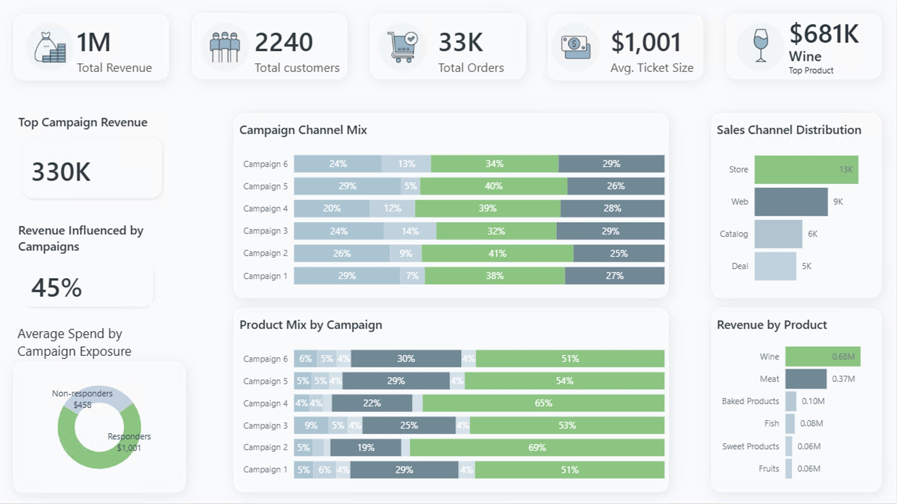
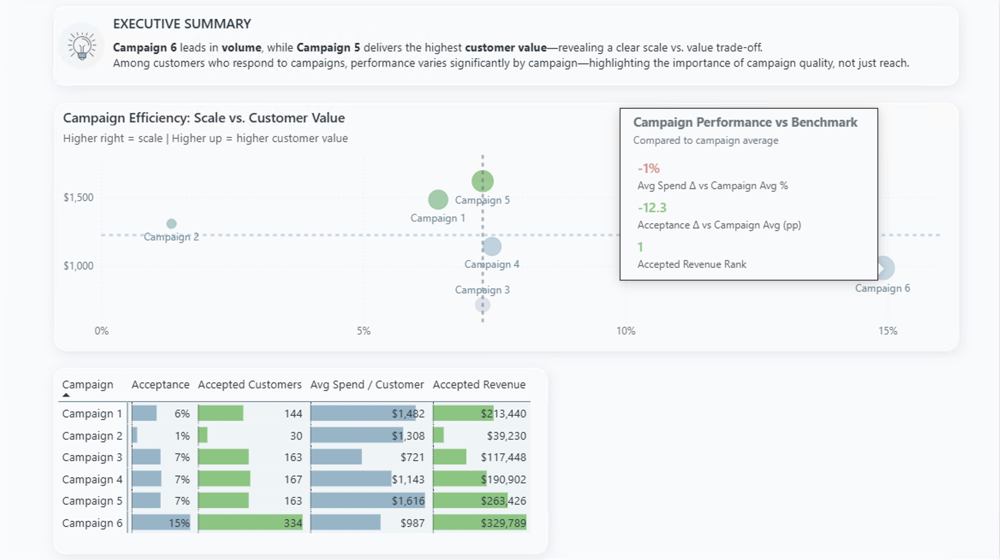
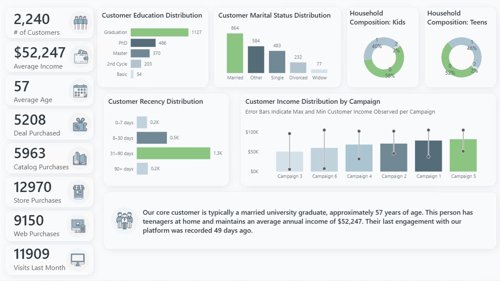

# Marketing Analytics Case Study – Power BI

*Interactive marketing analytics dashboard for campaign performance analysis*

---

## Quick Links
- 📸 [Full Dashboard Screenshots](#dashboard-screenshots)

- 📧 .pbix file available upon request
---

## Project Overview
This is a **Power BI marketing analytics project built for portfolio purposes**, based on a structured business brief and a provided dataset.

The goal of the project was to design an **executive-ready analytics solution** that surfaces insights around campaign performance, product contribution, and customer behavior, using a limited but realistic dataset.

The emphasis is on **decision-oriented analysis**, data modeling, and advanced Power BI techniques rather than basic reporting.

---

## Business Context
The project addresses a marketing analytics use case focused on understanding:
1. Performance differences across recent marketing campaigns  
2. Revenue contribution by product categories  
3. Customer composition and behavioral patterns  
4. Factors influencing campaign acceptance and purchasing decisions  

The dashboard is designed to support analytical exploration and high-level decision-making.

---

## Dataset
The analysis is built on a provided sample dataset that includes:
- Campaign-level metrics
- Customer demographics and engagement data
- Product and sales channel information
- Purchase behavior indicators

The data is **anonymized** and used exclusively for portfolio demonstration purposes.

---

## Semantic Model
The Power BI semantic model includes:
- A central fact table with campaign and customer interactions
- Supporting dimension tables for:
  - Campaigns
  - Products
  - Platforms
  - Responder groups
- A dedicated **measures table** for DAX calculations
- A separate helper table used for **dynamic product icons**, stored as Base64

The model is designed to support:
- Flexible slicing by campaign, product category, and customer attributes
- Advanced DAX-driven insights and narratives

---

## Dashboard Pages & Key Features

### 📊 Executive Overview
- High-level KPIs: Revenue, Customers, Orders, Average Ticket Size
- **Top Product section independent of report filters**
  - Implemented using a dedicated table and DAX logic
  - Product icons rendered from Base64 images
- Clear separation between global performance and filtered analysis
- Campaign channel mix and product distribution analysis
- Revenue influenced by campaigns metric

---

### 🎯 Campaigns Efficiency
- Campaign performance compared against campaign averages
- Scatter plot with:
  - Scale vs. customer value positioning
  - **Custom tooltip page** built specifically for the scatter visual
- Executive summary with key insights
- Detailed campaign metrics table with visual indicators
- Ranking and benchmarking logic implemented in DAX

---

### 👥 Buyers Composition
- Customer demographics and behavior analysis
- Education, marital status, household composition, income, recency
- **Dynamic text narrative** that describes the "ideal customer"
  - The text updates automatically based on current slicer selections
  - Fully driven by DAX measures, not static text
- Income distribution by campaign with error bars showing range
- Customer recency analysis

---

### 🔍 Purchase Drivers
- Key Influencers visual used to explain:
  - Campaign acceptance drivers
  - Sales increase drivers
- Product category filters with custom icons
- Segmentation logic based on customer attributes and engagement patterns
- Interactive analysis of what influences customer behavior

---

## Technical Highlights

### Advanced DAX
- **Dynamic customer narrative**: Automatically generates natural language text that describes the ideal customer profile based on current filter selections. Uses `SELECTCOLUMNS` and `TOPN` to identify the most common demographic values, `SWITCH` statements to convert data values into readable text (e.g., "Graduation" → "university graduate"), conditional logic with multiple `IF` statements to handle household composition variations, and `FORMAT` functions to present numbers naturally. The measure builds a complete grammatically correct sentence that updates in real-time as users interact with slicers.

- **Filter-independent Top Product**: Shows the top-selling product regardless of active report filters. Uses `ALL()` to remove filter context on the products table, `SUMMARIZE` to aggregate sales by product, and `TOPN` to identify the highest-selling product globally.

- **Campaign benchmarking**: Variance calculations comparing individual campaigns to averages

- **Custom measures table**: Centralized DAX logic for maintainability

### Custom Features
- **Custom Tooltip Pages**: Dedicated scatter plot tooltip showing detailed campaign metrics on hover

- **Dynamic Icons**: Product images rendered from Base64-encoded strings stored in a helper table, independent of filter context. Uses measure chaining where one measure identifies the globally top-selling product (using the filter-independent logic), then a second measure uses `LOOKUPVALUE` to retrieve the corresponding Base64 image string from the helper table. The icon visual always displays the top product regardless of active filters.

- **Key Influencers AI**: Leveraging Power BI's AI capabilities for automated insight generation

### Data Modeling
- **Star schema design**: Optimized for analytical queries
- **Proper relationships**: Managing cardinality and filter direction
- **Dedicated measures table**: Clean separation of calculations from data

### UX Design
- **Executive-friendly layouts**: Clear visual hierarchy and minimal clutter
- **Consistent color scheme**: Green for highlights/top performers, neutral tones for standard data
- **Logical page flow**: Story-driven navigation from overview to detailed analysis

---

## Dashboard Screenshots

### Executive Overview

*High-level KPIs and revenue distribution across channels and products*

---

### Campaigns Efficiency

*Scatter plot analysis with custom tooltip showing scale vs. customer value trade-offs*

---

### Buyers Composition

*Demographic analysis with dynamic narrative that adapts to filter selections*

---

### Purchase Drivers

*AI-powered Key Influencers analysis revealing what drives campaign acceptance and sales*

---

## Skills Demonstrated

**Power BI**
- Power BI Desktop & Power BI Service
- Report design and layout optimization
- Custom tooltips and interactive features
- Publishing and sharing dashboards

**DAX (Data Analysis Expressions)**
- Advanced calculations using `CALCULATE`, `ALLSELECTED`, `SWITCH`
- Dynamic text generation
- Filter context manipulation
- Measure optimization for performance

**Data Modeling**
- Star schema design
- Relationship management
- Cardinality and filter direction
- Helper tables for advanced scenarios

**Business Intelligence**
- KPI selection and definition
- Insight generation and narrative building
- Executive communication
- Analytical thinking and problem-solving

**Data Visualization**
- Chart selection for different data types
- Color theory and visual hierarchy
- UX principles for analytics
- Storytelling through data

---

## Tools & Technologies
- **Power BI Desktop** - Dashboard development
- **Power BI Service** - Publishing and sharing
- **DAX** - Advanced calculations and measures
- **Power Query** - Data transformation

---

## Notes
- This is a **portfolio project** created to demonstrate Power BI and analytics capabilities
- Data is anonymized and used exclusively for demonstration purposes
- The project emphasizes analytical depth and technical implementation over dataset size
- Focus is on decision-oriented insights rather than operational reporting

---

## Future Enhancements
Potential additions for future iterations:
- Time-series analysis with trend forecasting
- What-if parameters for scenario planning
- Drill-through pages for deep-dive analysis
- Mobile-optimized layouts
- Integration with external data sources

---

## Contact
Questions or feedback? Feel free to reach out:
- **LinkedIn**: [Irina Ardeleanu](www.linkedin.com/in/irina-ioana-ardeleanu)
- **Email**: irina.ioana.ardeleanu@gmail.com

---

*This project was created as a portfolio piece to demonstrate Power BI capabilities in marketing analytics, data modeling, and business intelligence.*
